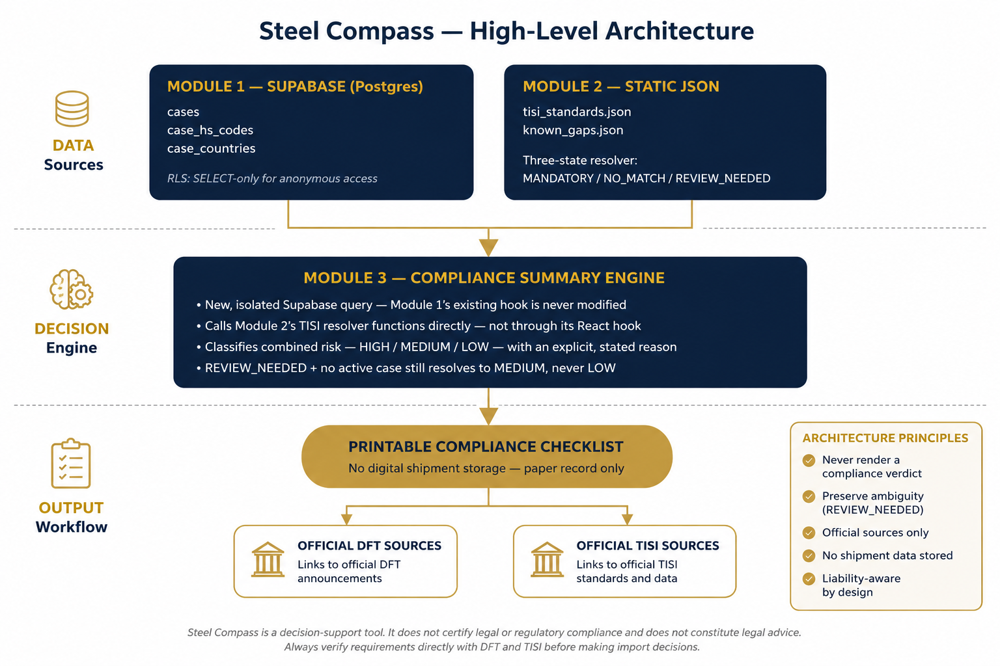

# Steel Compass — Case Study

**How a solo build turned a niche compliance problem into a working MVP,
and the decisions that mattered more than the code.**

This is the longer story behind [`README.md`](./README.md) — written for
anyone who wants to understand not just what Steel Compass does, but how
and why it was built the way it was.

```
Problem  →  Research  →  Decisions  →  MVP  →  Lessons learned
```

---

## Why I built this

I spent 19 years in import-export operations, most of it inside Japanese
corporate environments, including eight years specifically in steel
trading — managing export-import documentation and L/C negotiations,
where careful compliance checking was a daily operational responsibility.
That didn't happen by accident; it took constant, careful checking,
spread across systems and people that didn't talk to each other.

In late 2023 I started pivoting toward business systems design and
AI-assisted development — turning the same instinct that kept those years
violation-free into something that could scale past what one careful
person can hold in their head. Steel Compass is the first real product
of that pivot: built for the version of myself that used to have to check
DFT and TISI separately, by hand, every time.

---

## 1. The problem

Steel import compliance in Thailand sits at the intersection of two
completely separate regulatory systems that nobody has put in one place:

- **DFT trade remedy measures** — Anti-Dumping (AD), Anti-Circumvention
  (AC), Safeguard (SG), and Countervailing (CVD) duties, published by 
  the Department of Foreign Trade, changing over time, sometimes overlapping 
  (a single HS code can be the subject of five different cases at once, 
  active and terminated, spanning a decade).
- **TISI mandatory product standards** — a completely independent
  regulatory system requiring import licenses for specific HS codes,
  administered by the Thai Industrial Standards Institute.

An importer has to check both, separately, and the two systems don't talk
to each other. In practice, that produces four specific, expensive
failure modes I kept hearing about:

1. **Sales commits before checking anything.** A contract gets signed,
   the import team finds out about the shipment with no runway left to
   investigate AD/AC/SG/CVD exposure or licensing before goods are already
   moving.
2. **An HS code gets checked once, then lost.** Goods get consolidated
   into a shipment with other products, and the wrong code gets declared
   — resulting in fines, back-taxes, and margin loss on what should have
   been a routine import.
3. **TISI gets discovered at customs, not before.** Because it's a
   separate system from DFT, checking trade remedies tells you nothing
   about whether a mandatory import license is required.
4. **AD/AC/SG/CVD exposure gets discovered mid-shipment, not before purchase.**
   The importer has already quoted a selling price with no duty built
   in — then finds out, once the shipment is already moving or arriving,
   that the product is subject to Anti-Dumping, Anti-Circumvention, or
   Safeguard duties. Beyond the unplanned duty and tax, the delay adds
   warehouse storage charges, holds up delivery to the end customer's
   production line, and can turn a deal that looked profitable at quote
   time into a loss.

None of these are knowledge problems — the data is public. They're
**process and visibility** problems. That reframing shaped everything
that followed: this couldn't be a tool that tells people the answer. It
had to be a tool that makes it hard to skip looking.

## 2. Research

Before writing any code, the actual data had to be understood, not
assumed:

- **DFT case data** doesn't come as a clean API. I built a hand-curated
  master spreadsheet of AD/AC/SG/CVD cases, cross-checked against real DFT
  announcements — case status, duty rates, affected countries, HS code
  scope, dates. This was slow, deliberate work, and it stayed the source
  of truth throughout the build rather than something I automated away
  early and trusted blindly.
- **TISI data** exists as CKAN Open Data plus a hand-curated product-standard
  XLSX sheets — I built a Python (openpyxl) pipeline to parse this into a
  static JSON file, with a SHA-256 hash sidecar so the app can verify at
  runtime that the data hasn't been tampered with between build and
  deploy.
- **Precision mattered more than I expected.** HS codes at 4-digit
  precision (a "heading") behave very differently from 8- or 11-digit
  codes for TISI purposes — a 4-digit code alone should never be able to
  produce a confident MANDATORY result, because the data genuinely isn't
  precise enough at that level. This became a hard architectural
  invariant, not a UI nicety.
- **Real gaps exist in the data itself** — HS heading 7306 (pipes and
  tubes) currently has no mandatory TISI standard mapped in the index at
  all. Rather than silently returning "no match" (which looks identical
  to "genuinely no requirement"), this gets surfaced explicitly as a
  known, documented gap requiring manual verification.

That last point ended up being the seed of the single most important
decision in the whole project.


<p align="center">

</p>

*Figure 1.
High-level architecture of Steel Compass.
Two independent regulatory data sources remain isolated until the
Compliance Summary Engine combines them into a single decision-support
workflow.*


## 3. Decisions

### The one that shaped everything: never render a verdict

Early on, it would have been easy to build a tool that says "Compliant"
or "Not Compliant." I deliberately didn't. A tool that's confidently
wrong about a shipment's compliance is worse than no tool — it's a real
liability, for the importer who trusted it and for me as the person who
built it.

Instead, Steel Compass has a **three-state TISI resolver**:
`MANDATORY / NO_MATCH / REVIEW_NEEDED`. `REVIEW_NEEDED` exists
specifically so genuine ambiguity — a known data gap, an imprecise HS
code — never quietly collapses into a false "you're clear." That
principle then propagated into the Compliance Summary's risk
classification: a `REVIEW_NEEDED` TISI result with no active DFT case
still classifies as **MEDIUM risk, never LOW** — because "we don't know"
is not the same claim as "it's fine," and the tool should never conflate
the two just because MEDIUM feels less reassuring to show.

### Why Supabase, not a heavier database, for the MVP

DFT case data needed real relational structure — cases, HS code mappings,
and country associations are genuinely many-to-many, not something a flat
file could represent cleanly. But this is a solo-maintained MVP, not a
system with a dedicated backend team. Supabase gave Postgres, row-level
security, and a REST layer with effectively no backend code to write or
operate — the right amount of database for the actual team size of one.
The trade-off, made consciously: the anonymous key is public in the
frontend bundle, which is safe specifically because RLS is configured to
allow SELECT only, with zero write policies for anonymous access. That
was verified, not assumed.

### Building one module at a time, deliberately

Rather than one long build, each module went through the same disciplined
sequence before the next one started: Architecture Design → review and
approval → Database Design → API Design → Frontend wireframe →
Implementation (one feature, one commit) → Testing → Security Review →
Deployment. Nothing moved forward until the current module was actually
working, not just coded.

This mattered in practice, not just in theory. Module 3 (Compliance
Summary) needed to combine Module 1's Supabase data and Module 2's TISI
logic — and the discipline of finishing Module 1 and Module 2 completely
first meant Module 3 could **reuse** them instead of reinventing anything.
Concretely: Module 3 calls Module 2's TISI resolution functions directly
(pure, already-tested functions) rather than mounting a second copy of
Module 2's search hook, and it queries the same Supabase tables through
its own isolated hook rather than modifying Module 1's existing query —
a small amount of duplicated query logic, deliberately accepted, in
exchange for never risking a regression in code that was already shipped
and working.

### Why not let AI (or the tool itself) decide compliance

It would have been technically straightforward to add a layer that takes
the DFT and TISI results and generates a confident natural-language
verdict — "this shipment appears compliant." I deliberately didn't build
that, and wouldn't, even though it's the kind of feature that demos well.
A generated sentence that sounds authoritative is exactly the failure
mode this whole project exists to prevent: it would let both the tool and
the person reading it feel more certain than the underlying data actually
supports. The three-state resolver and the risk classification table are
the alternative — structured, inspectable, and honest about ambiguity in
a way a generated summary sentence can quietly stop being.

### Small decisions that weren't obvious defaults

A few choices made along the way that could easily have gone the other
way, with the actual reasoning behind them:

- **Country of origin is a dropdown, not free text.** Free-text input
  risks a typo ("Vietnam" vs "VIETNAM") that silently produces a false
  "no measures apply" — indistinguishable from a genuine negative result.
  A dropdown built from real recorded country values can't fail that way.
- **No item in the print checklist auto-checks itself**, even when the
  system already knows the answer (e.g. TISI status was just confirmed
  two seconds earlier by the same search). A checked box is meant to mean
  "a person looked at this" — auto-checking it would quietly change what
  the checklist actually proves, in a domain where that distinction
  matters if it's ever the paper trail someone points to later.
- **The printed checklist has two separate sign-off lines** — "Initiated
  by" and "Reviewed by" — not one. This came directly from real failure
  scenarios described to me: sales committing to a shipment without ever
  notifying the import team. Starting the checklist *is* the
  notification; reviewing it is a separate, later event. Two roles,
  two timestamps, matching two different points where the process
  actually breaks in practice.
- **HS code and product name are the most visually dominant elements on
  the printed page**, deliberately oversized. The print artifact is meant
  to sit in a physical file and get glanced at weeks later during
  shipment consolidation — exactly the moment described in failure mode
  #2 above. A checklist that looks like a generic form, with the HS code
  buried in a small field, would have defeated its own purpose.

### The scope cut: Modules 4–6 became one print feature

The original roadmap planned three more modules after the Compliance
Summary Engine: a digital Workflow Checklist, an Evidence Section, and a
PDF Report Generator — all storing shipment data in the browser's
localStorage.

Partway through, I cut all three. Two reasons, both real: a persistent
digital record of "Company X is importing HS code Y from Country Z"
sitting in browser storage is exactly the kind of thing that shouldn't
exist if it doesn't need to, given genuine commercial confidentiality
concerns in this industry. And a small internal tool shouldn't ask a
busy sales or import team to learn a new digital workflow when a printed
page, already something they're used to filing, achieves the same goal
with far less friction.

The replacement — a single printable Compliance Checklist, no digital
storage at all — does less on paper than the original three-module plan,
and is a better product for the actual people using it. That's the
decision I'd point to first if asked what "product thinking" looked like
on this project, more than any individual feature.

## 4. The MVP

What actually shipped:

- **Module 1** — DFT Trade Remedy Reference: HS code lookup, product name
  search, full case browser, live against Supabase.
- **Module 2** — TISI Requirement Search: three-state resolver, 24
  standards, 5,000+ HS code mappings at full precision, documented known
  gaps.
- **Module 3** — Compliance Summary Engine: combines both into a
  risk-classified result with a printable checklist.
- **Security** — CSP and security headers via `vercel.json`, a
  domain-allowlist validator for all externally-sourced URLs, SHA-256
  integrity verification on the TISI data file, automated `npm audit` on
  every push, Supabase RLS confirmed SELECT-only for anonymous access.
- **UI** — a deliberate navy/gold visual identity, tabbed navigation
  restructured mid-project once a single long scrolling page proved to
  bury the tool's own best features below the fold.

Testing was structured manual verification rather than an automated
suite: real HS codes pulled directly from the actual case data, chosen
specifically to stress the decisions above — a HIGH-risk case with an
active DFT measure and a documented TISI gap, a MEDIUM case with
`REVIEW_NEEDED` and no active measure (the specific scenario the risk
table exists to protect), a single HS code with five overlapping DFT
cases (four active, one terminated) to confirm the terminated one
correctly renders as history rather than counting toward risk.

## 5. Lessons learned

**Ambiguity is a design constraint, not an edge case to patch later.**
The three-state resolver and the MEDIUM-not-LOW risk decision only work
because they were treated as core to the architecture from early on, not
bolted on after the "happy path" was built.

**Reuse discipline pays off exactly when you need it to.** Module 3 came
together faster than Module 1 or 2 did, precisely because it could lean
on tested, isolated code instead of re-solving problems Modules 1 and 2
had already solved.

**Small bugs taught real lessons about verification.** A few genuine
mistakes surfaced along the way — a component field name guessed
incorrectly instead of checked against the actual type definition, a
variable scoping bug where a value referenced outside its `try` block
wasn't visible there, a rendering pipeline occasionally dropping an
opening HTML tag in a way that looked identical to a copy-paste error
until compared carefully against the source. Each one was a reminder that
"looks right" and "is right" are different claims, and that checking the
real file or the real type definition beats confidently guessing, every
time.

**Cutting scope on purpose is a skill, not a failure.** The Modules 4–6
decision was harder to make than it was to justify afterward — there's a
real pull to finish what was planned. Recognizing that the plan itself
was solving the wrong problem, mid-build, and replacing it with something
smaller and better, was the single most valuable judgment call in the
whole project.

**Shipping matters more than polishing.** This went through real,
deployed iterations rather than staying in a local branch until it felt
finished — the tab layout, the print checklist, the color system all
changed shape after seeing them actually working, not while imagining how
they'd work. Waiting for "ready" would have meant never finding the
things that only show up once something is live.

**A tool for a regulated, high-stakes domain has to earn trust through
restraint, not confidence.** Every disclaimer, every "REVIEW_NEEDED"
instead of a guess, every refusal to auto-check a box — none of that
makes the product feel more impressive on a demo. All of it is what
makes it something a real import team could actually rely on.

---

Steel Compass started as a way to solve a problem I knew well. Today it's
a working MVP. My goal now isn't to add more features — it's to learn
from real importers, iterate carefully, and build something people can
genuinely trust.

Live demo: [steel-compass.vercel.app](https://steel-compass.vercel.app)
— see [`README.md`](./README.md) for the project overview.
