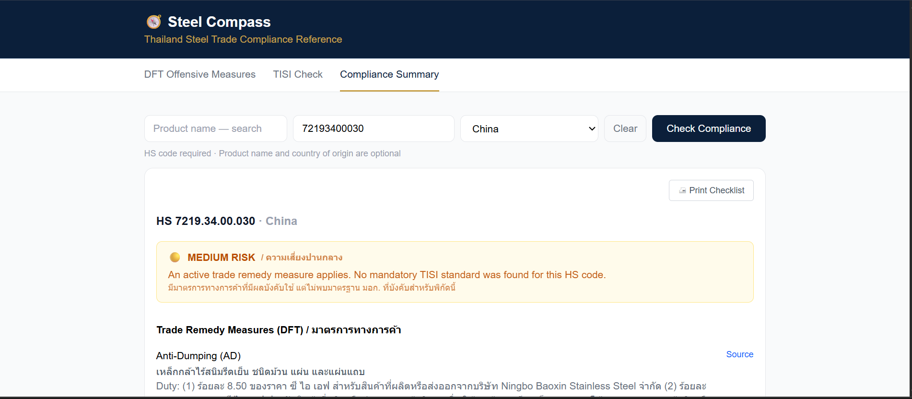
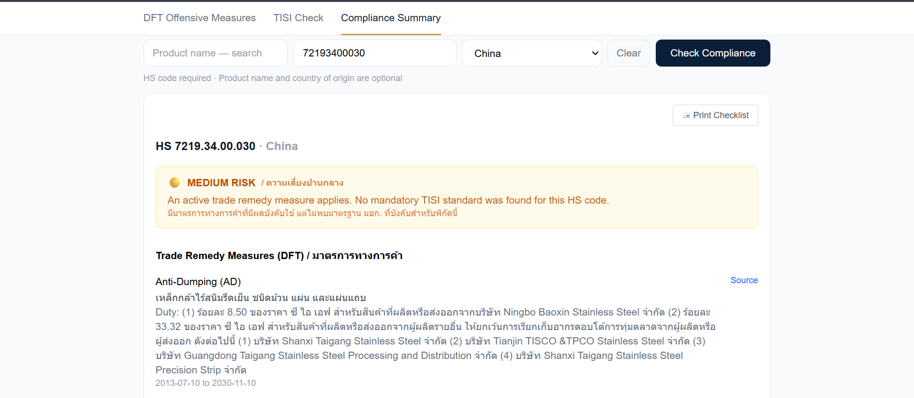
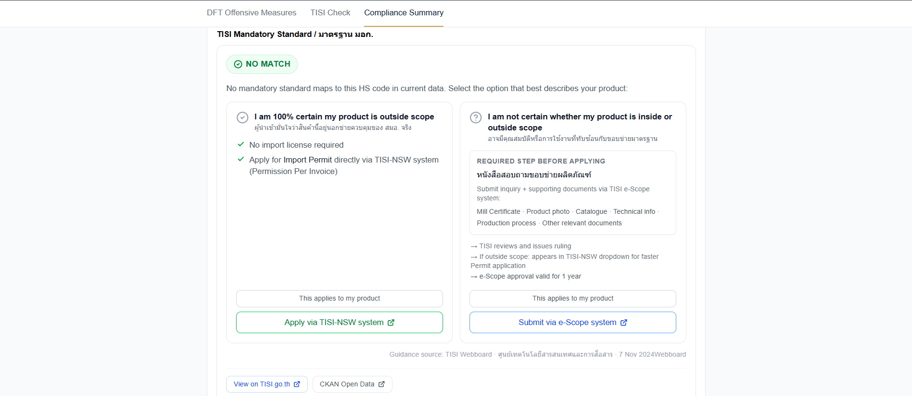
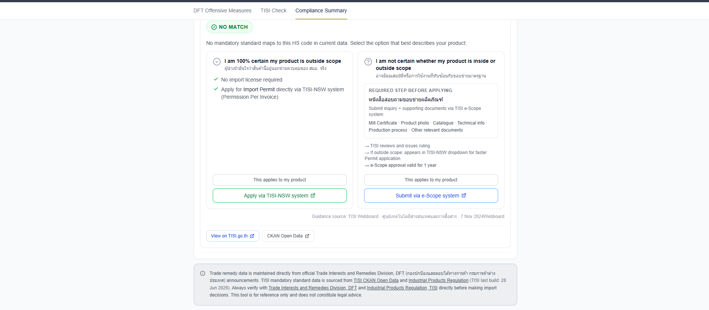

# 🧭 Steel Compass

**Helping steel importers spot compliance risks before they become expensive mistakes.**

A decision-support tool that brings Thailand's DFT trade remedy measures and
mandatory TISI product standards into one workflow — built solo, end-to-end,
by [Missboonyos](https://github.com/Missboonyos).

**[→ Try the live demo](https://steel-compass.vercel.app)** · Free during early access

---

### 🖼️ *[Hero screenshot — Compliance Summary MEDIUM RISK result]*

<p align="center">

</p>

<p align="center">

</p>

<p align="center">

</p>

<p align="center">

</p>
---

## Built solo. Live in production.

Architecture, data curation, frontend, and deployment — one person, working
as their own architect, PM, and QA. Full story of how that process worked
below in **[How it was built](#how-it-was-built)**, and in more depth in
[`CASE_STUDY.md`](./CASE_STUDY.md).

## Tech stack

| Layer | Choice |
|---|---|
| Frontend | Vite 8 + React 19 + TypeScript |
| Styling | Tailwind CSS v4 |
| DFT data | Supabase (Postgres, RLS, SELECT-only for anonymous access) |
| TISI data | Static JSON, built via a Python (openpyxl) pipeline against TISI's CKAN Open Data and XLSX product-standard sheets |
| Hosting | Vercel (Singapore region) |
| Security | CSP + security headers, domain-allowlisted URL validation, SHA-256 integrity verification on the TISI data file, automated `npm audit` on every push |

---

## The problem

The problem isn't that importers don't care about compliance. The problem
is that the information lives in different places, at different times,
owned by different organizations — and nobody has put it in one place.

- **DFT trade remedy measures** — anti-dumping duties, anti-circumvention
  measures, safeguard tariffs — published by the Department of Foreign
  Trade, changing over time, sometimes several overlapping cases on a
  single HS code at once.
- **TISI mandatory product standards** — a completely separate regulatory
  system requiring import licenses for specific HS codes.

Missing either isn't a paperwork inconvenience — it's real money:

> A single wrong or unchecked HS code can trigger back-taxes, anti-dumping
> duties retroactively applied, shipment delays at customs, and penalties
> — easily reaching into the hundreds of thousands of baht on a single
> shipment.

In practice, this shows up as four recurring, costly mistakes:

- **Sales commits to a deal before checking anything.** By the time the import team finds out, there's no time left to investigate exposure before goods are in transit.
- **An importer checks one HS code, then loses track of it during shipment consolidation** — and declares the wrong code for goods bundled in with others.
- **Nobody checks TISI requirements until customs asks for a license that doesn't exist yet** — because TISI is a completely separate system from DFT's trade remedies, and checking one doesn't tell you about the other.
- **AD/AC/SG exposure gets discovered mid-shipment, not before purchase.** The importer has already quoted a selling price with no duty built in — then finds out, once the shipment is already moving or arriving, that the product is subject to Anti-Dumping, Anti-Circumvention, or Safeguard duties. Beyond the unplanned duty and tax, the delay adds warehouse storage charges, holds up delivery to the end customer's production line, and can turn a deal that looked profitable at quote time into a loss.

Steel Compass makes it structurally harder to skip these checks — not with chatbot-style advice, but by surfacing the actual official data clearly, fast, in one place.

## What it does

Built around how an importer actually works through a shipment, not how the codebase is organized:

**1. Search** — Search DFT Anti-Dumping, Anti-Circumvention, and Safeguard cases by HS code or product name (Thai or English), live against Supabase. Every case shows its duty rate, affected countries, status, and a direct link to the official DFT announcement.

**2. Check** — Check whether the same product requires a mandatory TISI standard and import license, via a three-state resolver — **MANDATORY / NO_MATCH / REVIEW_NEEDED** — that never collapses genuine data ambiguity into a false "you're clear."

**3. Summarize** — Combine both into one risk-classified result — 🔴 HIGH / 🟡 MEDIUM / 🟢 LOW — with the specific reason spelled out, not just a color. Includes product-name search with HS-code autocomplete for when you know the product but not the code.

**4. Print** — Print the result to a clean, purpose-built page — HS code unmissable, blank sign-off lines, plain-language disclaimer — designed to physically travel with a shipment's paperwork.

## 🎬 Demo
<p align="center">

</p>

## What it deliberately does *not* do

**Steel Compass never renders a compliance verdict.** It does not say "this shipment is compliant" or "you are clear to import." It shows what the official DFT and TISI data says — including when that data is genuinely ambiguous — and leaves the decision to the person who knows the shipment. A tool that confidently tells an importer "you're fine" and turns out wrong is a liability, both for the importer and for whoever built it. Every architectural decision in this project protects that line.

## Why steel?

I spent 19 years in import-export operations, much of it inside Japanese
corporate environments — including eight years specifically in steel
trading, where careful compliance checking was part of my day-to-day
work. I later moved into business systems design and AI-assisted
development. Steel felt like the right place to build a first product: a
domain I understand from the inside, where the compliance complexity is
real, the cost of getting it wrong is real, and the people affected are
people I used to be one of.

## Design principles

- **Never guess.** Ambiguous data stays ambiguous in the output — it never resolves to a clean-looking answer.
- **Explain uncertainty. Don't hide it.** `REVIEW_NEEDED` isn't a failure state — it's the tool being honest about what it actually knows.
- **Official sources only.** Every result links back to the actual DFT or TISI source, not a paraphrase.
- **Liability-aware by default.** Decision-support, not certification — this shaped every screen, every label, every disclaimer.
- **Simplicity over feature count.** Cut three planned modules mid-build once a simpler solution served users better (see below).

## Known limitations

- **DFT data has no automated update pipeline yet** — maintained via a hand-curated master spreadsheet, cross-checked against official announcements, then entered into Supabase manually.
- **TISI heading 7306 (pipes and tubes)** has no mandatory standard currently mapped — documented explicitly as a known gap.
- **No automated test suite yet** — testing so far is structured manual verification against real case data.
- **Thailand-specific scope** — the underlying architecture (three-state resolver, risk aggregation) could generalize to other regulated categories or countries; not implemented.
- **No authentication yet.** Deliberately omitted during the MVP because the application currently stores no customer or shipment data. Authentication will be introduced together with private workspace features, not before there's something private to protect.

## Roadmap

```
MVP (live now)  →  Pilot with real importers  →  Paid SaaS  →  AI-assisted copilot
```

**Current focus:**
- ✔ Validate real workflows with actual importers
- ✔ Learn from real usage and feedback
- ✘ Not adding AI features yet

Free during early access is a deliberate choice, not a placeholder pricing
page — the goal right now is real signal, not revenue.

## How it was built

Built solo, using a deliberately disciplined, one-module-at-a-time workflow: **Architecture Design → review and approval → Database Design → API Design → Frontend wireframe → Implementation → Testing → Security Review → Deployment**, repeated per module, with nothing moving forward until the current module was designed, built, tested, and deployed.

Partway through, three planned modules (a digital Workflow Checklist, an Evidence Section, a PDF Report Generator) were cut in favor of the single printable checklist described above — a deliberate scope decision, not an unfinished roadmap. Full reasoning, and the rest of the product decisions behind this project, are written up in [`CASE_STUDY.md`](./CASE_STUDY.md).

### What I learned building this

- Making architecture decisions under real regulatory uncertainty, not textbook conditions
- Designing for genuine ambiguity rather than forcing a clean answer
- Security-first frontend design with a public anon key and RLS-protected data
- Using AI-assisted development in a structured, reviewed way rather than "generate the whole app"
- Cutting scope deliberately mid-build when a simpler solution served users better than the original plan

## Access

The repository is intentionally closed while Steel Compass evolves into a
commercial product. Architecture walkthroughs are available upon request.

**[Try the live demo →](https://steel-compass.vercel.app)**

---

## Disclaimer

Steel Compass is a reference and decision-support tool. It does not certify legal or regulatory compliance and does not constitute legal advice. Always verify requirements directly with Thailand's Department of Foreign Trade (DFT) and the Thai Industrial Standards Institute (TISI) before making import decisions.

---

Built solo — architecture, data pipeline, and frontend — as the foundation of a future business. Deeper writeup of the product decisions behind it: [`CASE_STUDY.md`](./CASE_STUDY.md).
